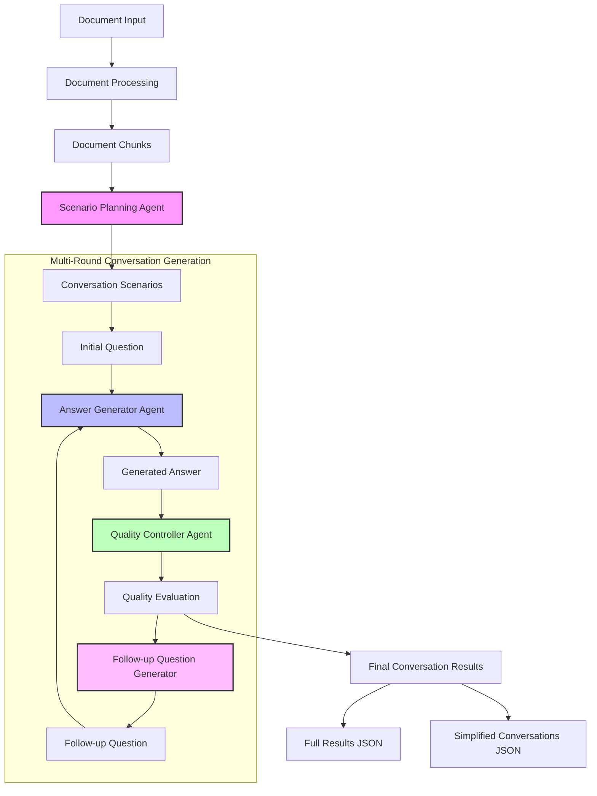

# Agentic Conversation Generator

## Project Overview

The Agentic Conversation Generator is a system that creates realistic, multi-turn conversations based on document content. It leverages multiple specialized AI agents working together to generate natural-sounding questions and answers that reflect the information contained in provided documents. The system uses Pydantic AI to create structured, type-safe agents that collaborate effectively in a pipeline architecture.

This project demonstrates how multiple AI agents can work together to perform complex tasks that require different specialized capabilities, creating human-like conversations that explore document content in a natural way.

## System Architecture

I've designed the system with a modular architecture where specialized agents handle specific aspects of conversation generation:

### Key Components:

1. **Document Processing**: Splits input documents into manageable chunks with appropriate overlap to maintain context.
2. **Scenario Planning Agent**: Analyzes document content to create realistic conversation scenarios.
3. **Question Generator Agent**: Creates natural-sounding questions based on document content.
4. **Answer Generator Agent**: Produces accurate answers based on document content.
5. **Quality Controller Agent**: Evaluates the quality of generated question-answer pairs.
6. **Conversation Pipeline**: Orchestrates the flow between agents to create multi-turn conversations.

## How Each Agent Works

### 1. Scenario Planning Agent

This agent sets the stage for conversations by analyzing document content and creating realistic scenarios. It:

- Identifies the primary domain and key topics from document chunks
- Generates user personas with backgrounds, goals, and information needs
- Creates initial questions for each scenario
- Establishes context for conversations

For example, when analyzing a document about healthcare AI, it might create a scenario with a "Healthcare Administrator" persona who wants to understand the regulatory implications of implementing AI systems in their hospital.

### 2. Question Generator Agent

This agent creates natural, conversational questions based on document content. It:

- Generates questions that are directly answerable from document content
- Creates diverse questions covering different aspects of the document
- Ensures questions sound natural and conversational

The agent transforms technical content into questions a real person might ask, adding conversational elements like "I was wondering..." or "Could you tell me..." to make them sound more natural.

### 3. Answer Generator Agent

This agent produces accurate, helpful answers based on document content. It:

- Generates answers directly based on document information
- Creates comprehensive but concise responses
- Uses a natural, conversational tone
- Cites sources appropriately

When answering questions, it retrieves the most relevant document chunks and formats responses to sound like a helpful human expert rather than an AI system.

### 4. Quality Controller Agent

This agent evaluates the quality of generated question-answer pairs. It:

- Assesses factual accuracy of answers (comparing to source documents)
- Evaluates relevance of answers to questions
- Checks naturalness of conversation flow
- Provides detailed feedback and scores

This quality control step ensures that the generated conversations meet high standards for accuracy, relevance, and naturalness.

## Pydantic AI in picture

Pydantic AI is a key technology that enables the structured, type-safe agent architecture in this project:

1. **Structured Data Models**: Pydantic models define the inputs and outputs of each agent, ensuring type safety and validation.

2. **Agent Framework**: The `Agent` class from Pydantic AI provides a consistent interface for creating and running agents.

3. **Tool System**: Agents can define tools (methods) that can be called during execution, allowing for modular functionality.

4. **Model Integration**: Seamless integration with LLM providers (in this case, DeepInfra's API for Llama 3.3 70B).

5. **Usage Tracking**: Built-in tracking of token usage and other metrics.

6. **Debugging Support**: Debug mode allows for detailed logging of agent operations.

## The Conversation Generation Process

The conversation generation process follows these steps:

1. **Document Processing**:
   - Input text is split into manageable chunks with appropriate overlap
   - Each chunk is assigned a unique ID and metadata

2. **Scenario Planning**:
   - The scenario planning agent analyzes document chunks to identify the domain and key topics
   - It generates 3-4 realistic conversation scenarios with user personas
   - Each scenario includes a title, persona details, context, and an initial question

3. **Multi-Round Conversation Generation**:
   - For each scenario:
     - Start with the initial question from the scenario
     - Generate an answer using the answer generator
     - Evaluate the answer quality using the quality controller
     - Generate follow-up questions based on conversation history
     - Repeat for the specified number of conversation rounds

4. **Result Generation**:
   - Complete conversation results are saved with detailed metadata
   - Simplified conversations (just question-answer pairs) are also saved
   - Usage statistics are logged

## Example of a Generated Conversation

Here's an example of a conversation generated by the system based on a document about AI in healthcare:

**Scenario**: Compliance Inquiry

**Persona**: Jane Doe, Regulatory Compliance Officer
- Background: Works for a medium-sized manufacturing company
- Goals: Ensure company compliance with latest regulations

**Conversation**:

Q1: What are the latest regulations regarding waste management?
A1: The information is not available in the provided documents.

Q2: What are the consequences of not following proper waste management regulations?
A2: The provided document chunks do not contain information about the consequences of not following proper waste management regulations. The chunks appear to be related to artificial intelligence in healthcare, discussing its applications, challenges, and future directions. Therefore, the answer to the question cannot be found in the provided documents.

Q3: What are some potential benefits of using AI in healthcare?
A3: Based on the retrieved chunks, some potential benefits of using AI in healthcare include:
1. Improved diagnostic accuracy: AI algorithms can analyze medical images and detect abnormalities with high accuracy, potentially saving thousands of lives through early detection.
2. Enhanced clinical decision-making: AI-powered clinical decision support systems can analyze patient data and provide treatment recommendations and risk assessments, suggesting evidence-based interventions.
3. Personalized treatment plans: AI can help develop personalized treatment plans for patients, such as IBM Watson for Oncology, which analyzes patient medical information against a vast database of medical literature to recommend treatment options for cancer patients.
4. Predictive analytics: AI can be used to predict patient outcomes, identify high-risk patients, and prevent readmissions, as mentioned in the chunk on predictive analytics.
These benefits have the potential to improve patient outcomes, reduce healthcare costs, and enhance the overall quality of care. However, it's essential to note that the implementation of AI in healthcare also faces challenges, such as ensuring the accuracy and reliability of AI systems, addressing regulatory and ethical concerns, and integrating AI into clinical workflows.

**Quality Evaluation**:

For the third question-answer pair:
- Factual accuracy: 0.9/1.0
- Relevance: 0.95/1.0
- Naturalness: 0.85/1.0
- Overall score: 0.9/1.0
- Passed: true

## Output Format

The system generates two types of output files:

1. **Full Results** (`conversation_results_[timestamp].json`):
   - Complete details of all scenarios and conversations
   - Includes quality evaluations, source chunk IDs, and metadata

2. **Simplified Conversations** (`simplified_conversations_[timestamp].json`):
   - Just the question-answer pairs organized by scenario
   - Easier to read and use for demonstration purposes

